# Leveraging-Machine-Learning-And-Interior-Recommendation-Service
이 프로젝트는 사용자 인테리어 성향을 파악하고 홈페이지내에서 해당 성향의 상품을 제공하여 사용자 맞춤 인테리어 제공 서비스 입니다.

***

## Hello-Home

김인호 
엄동식 
최준혁 
안홍선 
최소희 

***

## 프로젝트 수행 과정
> 핵심과제

1. 인테리어 스타일 분류
2. 스타일별 특성 파악
3. 설문을 통한 데이터 수집
4. 데이터 전처리 후 지도학습
5. 학습된 모델 웹페이지 탑재

> 접근 방식

1. 논문 조사를 통한 인테리어 스타일 대분류
2. 인테리어 전문 카페를 통한 학습데이터 수집
3. 다양한 모델 테스트를 통해 적절한 모델 찾기
4. 학습된 모델을 웹페이지를 통해 사용자에게 추천 서비스  제공

> 플라스크 서버 활용

1. 설문조사 또는 32강 월드컵기능을 활용하여 회원 개인의 인테리어 성향 정보를 파악한다.
2. 파악한 정보를 XGBoost 모델을 활용하여 분석후 개인 맞춤 인테리어 제품을 제공한다.

***
## 화면 구성

</img>
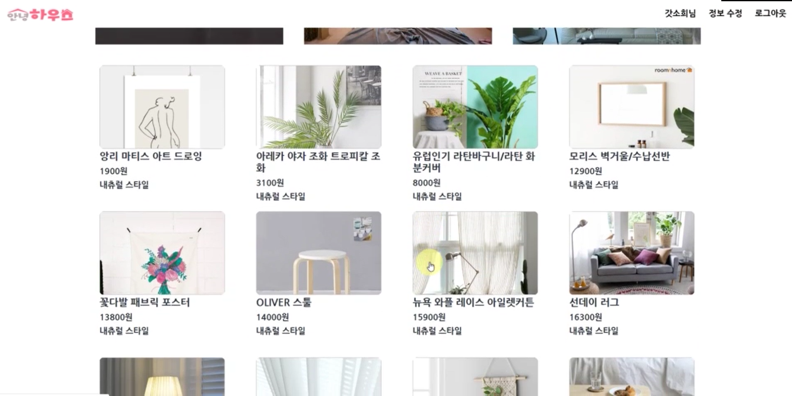</img>
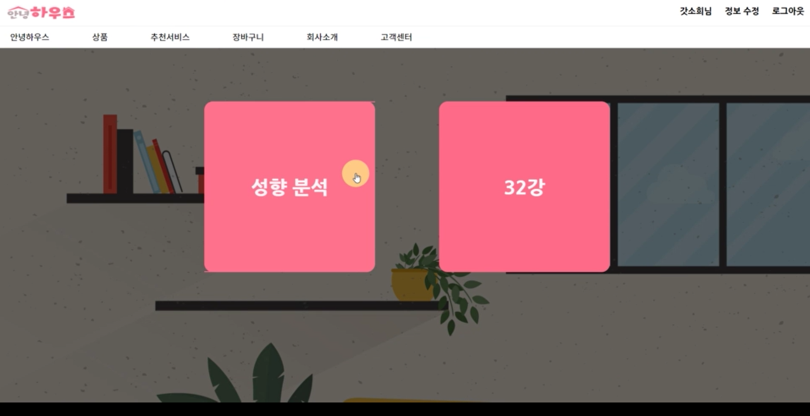</img>
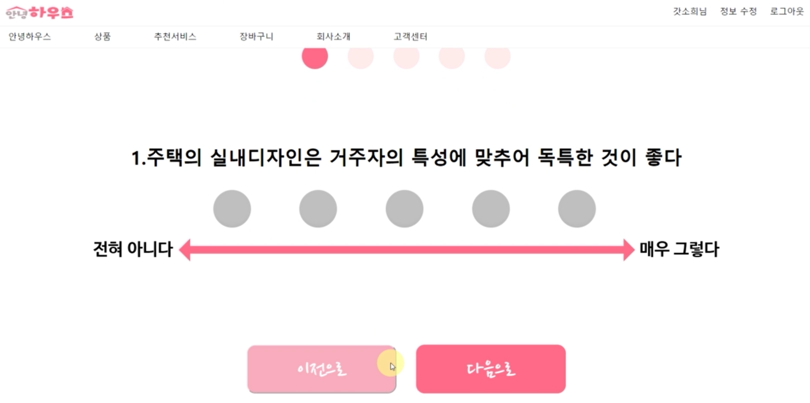</img>
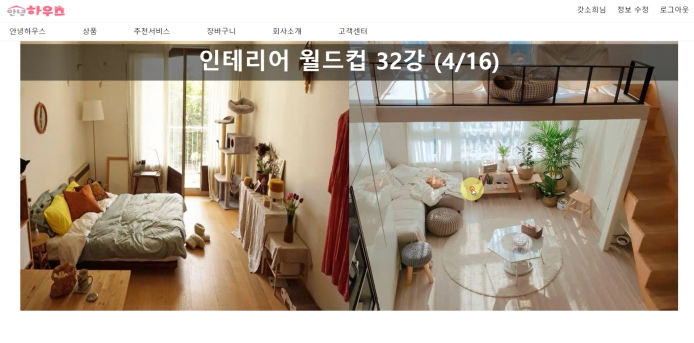</img>
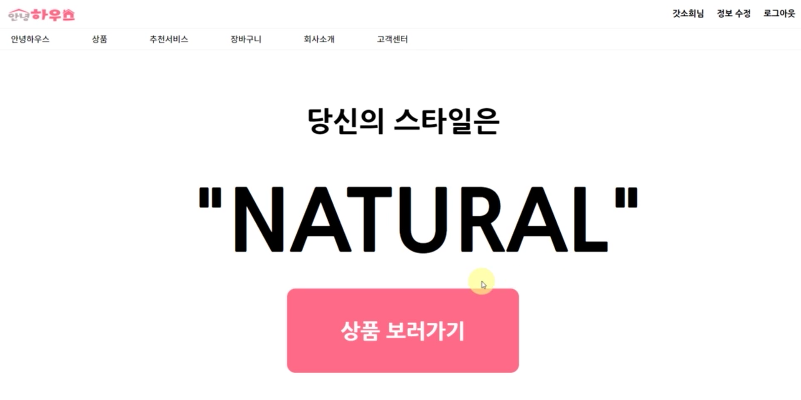</img>
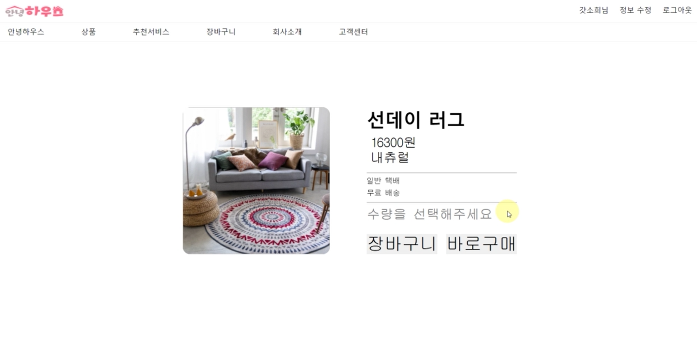</img>
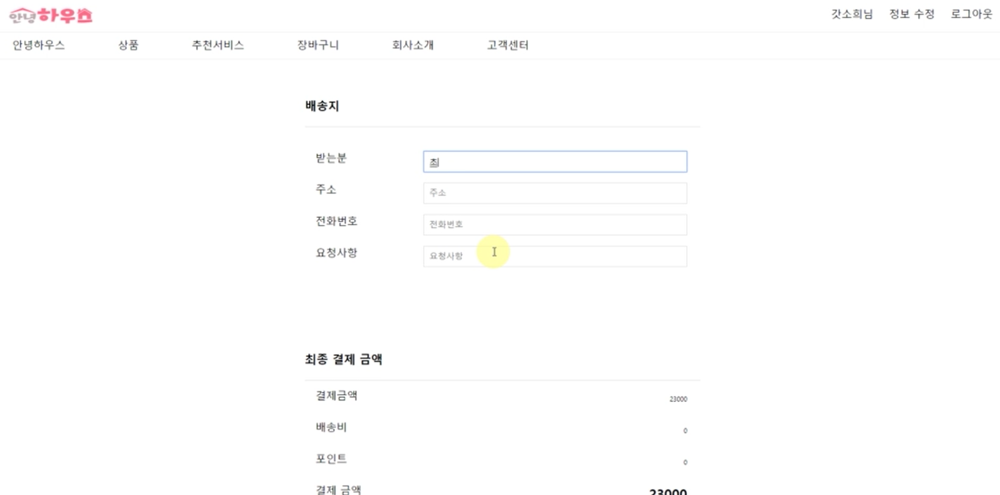</img>

***
## DB

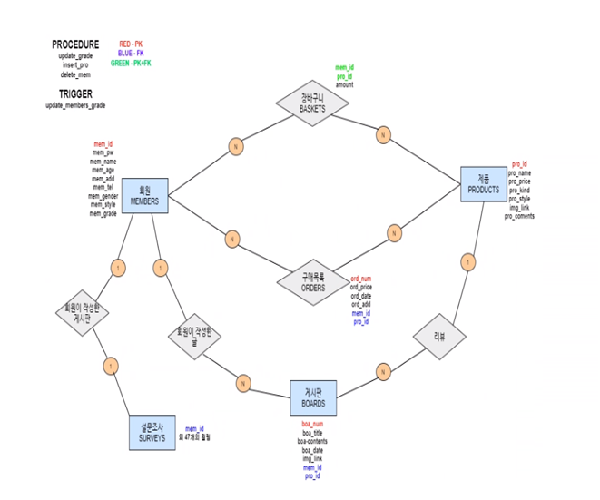</img> 

> 테이블
1. 사용자 : 사용자 ID, 비밀번호, 이름, 나이, 주소, 전호번호, 성별, 성향, 멤버등급
2. 상품 : 상품 번호, 상품 이름, 가격, 종류, 성향, 상품평, 상품 이미지
3. 장바구니 : 회원아이디, 상품 번호, 상품 수량
4. 주문 : 주문번호, 가격, 날짜, 주소, 회원아이디, 상품 번호
5. 게시판 : 글 번호, 제목, 회원아이디, 상품 번호, 내용, 이미지, 게시 날짜
6. 설문조사 : 47개 컬럼으로 이루어진 질문으로 로그인한 회원의 설문조사 결과 저장

***
## 머신러닝

> ## 설문지 작성

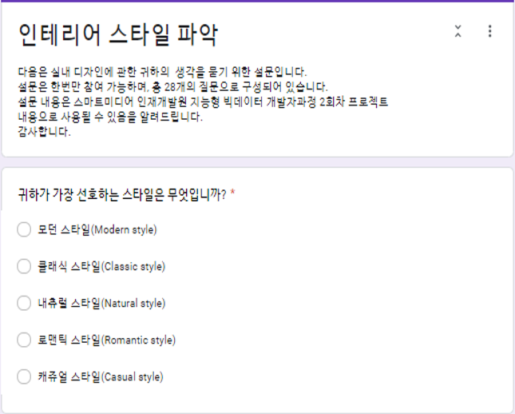</img>
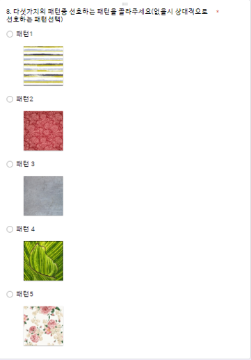</img>

    논문을 통해 인테리어 스타일을 분류
    특성 차이를 보이는 5가지 스타일로 분류(Modern, Natural, Classic, Casual, Romantic)
    총 28가지 질문 구성(스타일, 패턴, 색상, 성격, 형용사)

> ## XGBoost

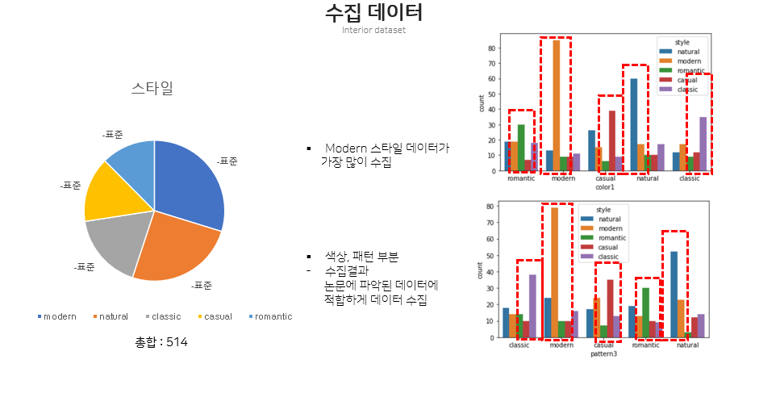</img>
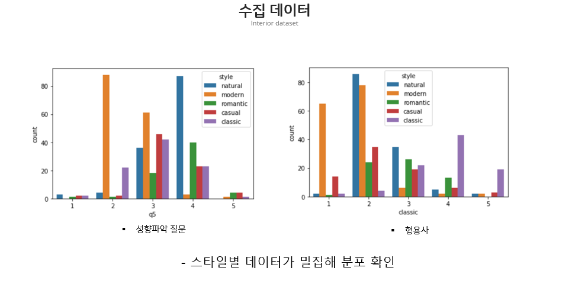</img>
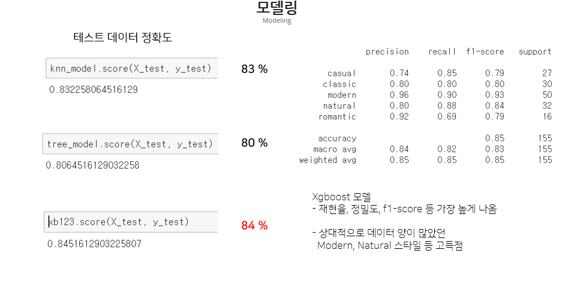</img>

### 전처리 

    전문 카페를 통한 설문 데이터 수집(총 514개)
    이상 값 제거 및 데이터 시각화 후 전처리 과정
    정제 데이터 더미화(47개 컬럼)

### 분석

    상대적으로 데이터 양이 많았던 Modern, Natural 스타일 등이 고득점
    Xgboost 모델이 재현율, 정밀도, f1-score 등 전체적으로 좋은 성과를 보임

> ## 플라스크
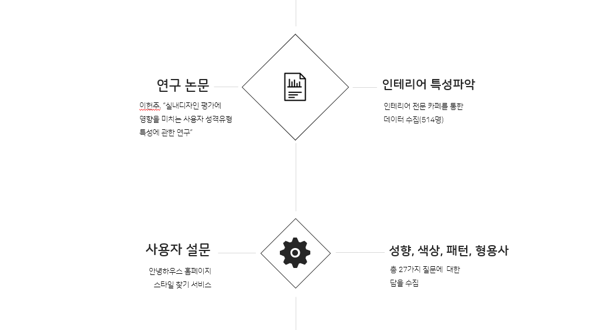</img>
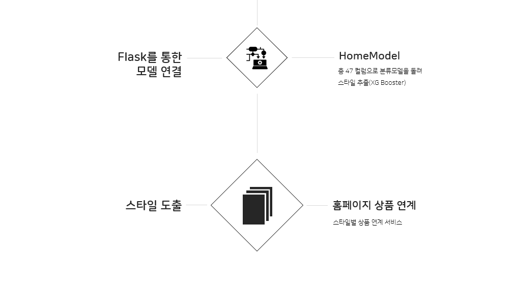</img>

    1. 설문지 또는 32강 월드컵 기능을 통해 확보한 회원 개인의 인테리어 성향 정보를 플라스크 서버를 활용해 전달
    2. 전달 받은 정보를 XGBoost모델을 활용해 분석
    3. 분석한 결과를 플라스크 서버를 이용해 상품정보를 톰캣서버로 전달